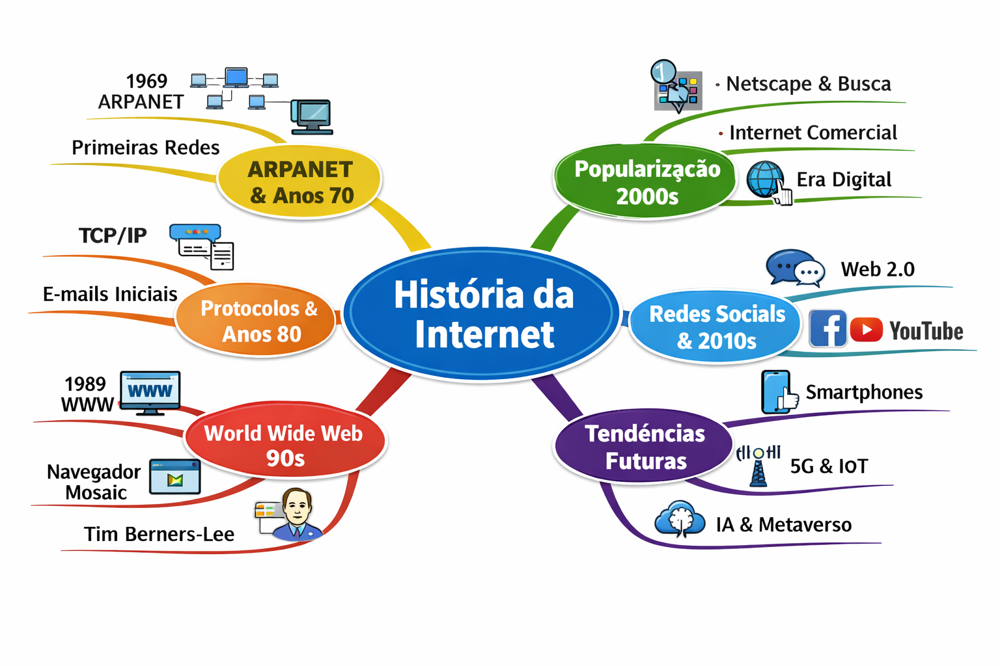

# 🌐 Miniguia de Estudos: História da Internet

## 🎯 Contexto e Objetivos
Este repositório foi criado como parte do desafio da DIO para explorar o uso da Inteligência Artificial como ferramenta de aprendizagem ativa.  
O tema escolhido é **História da Internet**, com o objetivo de:  
- Entender os principais marcos históricos da criação e evolução da Internet.  
- Explorar como a rede mundial de computadores transformou a sociedade, a economia e a cultura.  
- Criar um material de estudo consolidado e reutilizável para futuras revisões.  

---

## 📚 Curadoria de Fontes
As fontes selecionadas para estudo no NotebookLM foram:  
1. [Internet Society – História da Internet](https://www.internetsociety.org/internet/history/)  
2. [W3C – A World Wide Web Timeline](https://www.w3.org/History.html)  
3. [RFC 1 – Host Software (1969)](https://www.rfc-editor.org/rfc/rfc1)  
4. [Wikipedia – História da Internet](https://pt.wikipedia.org/wiki/Hist%C3%B3ria_da_Internet)  

---

## 🧠 Engenharia de Prompts e "Cicatrizes"

**Exemplos de prompts utilizados:**  

- "Explique como surgiu a ARPANET e sua importância para a Internet."  
- "Liste os principais marcos da evolução da Internet entre 1960 e 2000."  
- "Quais foram os impactos sociais da popularização da Internet nos anos 90?"  

**Dificuldades encontradas:**  

- Respostas muito técnicas → solução: pedir explicações em linguagem simples.  
- Informações desatualizadas → solução: validar com fontes confiáveis e recentes.  

---

## 🗓️ Cronograma de Estudos

| Semana | Período | Tópico Principal | Objetivo |
|--------|----------|------------------|-----------|
| 1 | 1960–1970 | ARPANET e primeiros computadores | Entender as origens da Internet |
| 2 | 1970–1980 | TCP/IP e redes acadêmicas | Compreender os protocolos de comunicação |
| 3 | 1980–1990 | World Wide Web | Diferenciar Internet e Web |
| 4 | 1990–2000 | Popularização | Analisar a expansão comercial e social |
| 5 | 2000–2010 | Redes Sociais | Entender a Web 2.0 e colaboração online |
| 6 | 2010–2020 | Internet Móvel e Nuvem | Identificar transformações tecnológicas |
| 7 | 2020–2026 | Tendências Futuras | Refletir sobre IA, IoT e metaverso |

---

## 🧩 Miniguia de Estudo (Entrega Final)

### 🔹 Resumos Estruturados

- **Década de 1960:** Criação da ARPANET, primeira rede de computadores interligados.  
- **Década de 1980:** Expansão das redes acadêmicas e surgimento do protocolo TCP/IP.  
- **Década de 1990:** Popularização da World Wide Web e dos navegadores.  
- **Anos 2000 em diante:** Redes sociais, smartphones e computação em nuvem.  

### 🔹 Glossário

- **ARPANET:** Rede pioneira criada pelo Departamento de Defesa dos EUA.  
- **TCP/IP:** Conjunto de protocolos que permite a comunicação entre redes.  
- **World Wide Web (WWW):** Sistema de documentos interligados acessados via Internet.  
- **Navegador:** Programa usado para acessar páginas da web (ex: Mosaic, Netscape, Chrome).  

### 🔹 Prompts Reutilizáveis

- "Resuma os principais marcos da História da Internet em ordem cronológica."  
- "Explique a diferença entre Internet e World Wide Web."  
- "Liste os impactos da Internet na educação e no trabalho."  

---

## 🧭 Mapa Mental

---# historia-da-internet-notebooklm
